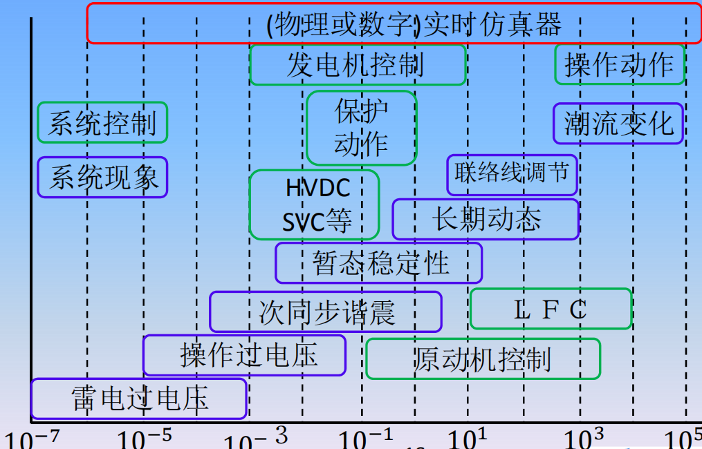
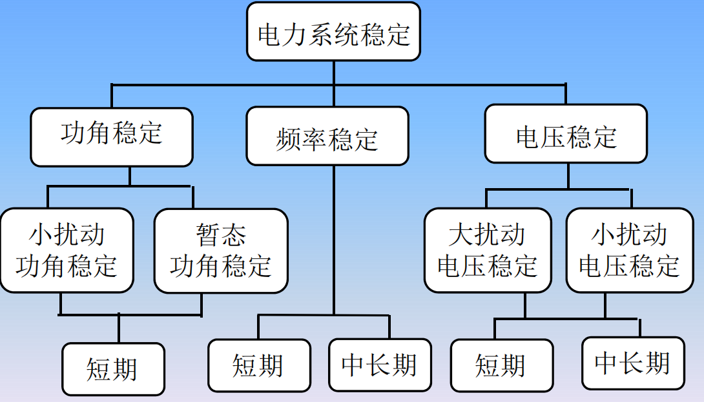
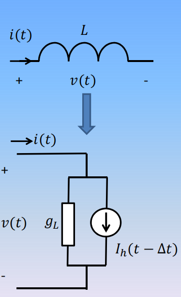

---
presentation:
  enableSpeakerNotes: true
---

```javascript{cmd=true}
// 使用默认格式显示幻灯片页码
Reveal.configure({ slideNumber: true });

// 可供选择的幻灯片页码格式：
//  "h.v":  当前横向幻灯片页码 . 当前纵向幻灯片页码 (默认)
//  "h/v":  当前横向幻灯片页码 / 当前纵向幻灯片页码
//    "c":  当前幻灯片页码（包括横向幻灯片和纵向幻灯片）
//  "c/t":  当前幻灯片页码 / 幻灯片总数
Reveal.configure({ slideNumber: 'c/t' });
```


<!-- slide  data-background-color="#ffebcf"-->
## 基于数字仿真的电力系统应用综合实验

## （一）绪论

<br>

**汪可友**
**上海交通大学**

2020年2月


-----------------------------------


<!-- slide  data-background-color="#ffebcf"-->
## 主要内容

- 课程介绍
- 电力系统仿真回顾
- 各种仿真软件的概述
- RTDS实时仿真介绍
- Matlab介绍

<!-- slide  data-background-color="#ffebcf"-->
## 课程性质

- 本课程是一门基于开放式电力系统教学实验平台的实验类课程，将电力系统专业课程的理论和实际相结合，进行各种电力系统教学实验。
- 教学目标：学生巩固所学电力系统专业课知识，培养学生动手能力、综合应用能力和创新能力。

<br>

**以==数字仿真==为主要手段**


<!-- slide  data-background-color="#ffebcf"  .element: style="text-align: left;" -->

## 什么是仿真

维基百科: A **simulation** is an approximate **imitation** of the operation of a process or system; the act of simulating first requires a model is developed.<!-- .element: style="text-align: left;" -->

- 仿真是对一个过程或系统的==近似的==模仿;
- 仿真需要先建立模型.


<!-- slide  data-background-color="#ffebcf"-->
## 物理模型, 数学模型和数值模型

- 以**变压器**为例:

- 物理模型:	实物模型


- 线性化时域数学模型: 
$$\left[ \begin{matrix} v_1\\ v_2 \end{matrix}\right]=\left[ \begin{matrix} L_{11}& L_{12}\\ L_{21} & L_{22} \end{matrix}\right] \frac{d}{dt} \left[ \begin{matrix} i_1 \\ i_2\end{matrix} \right]$$

- 数值模型:	采用不同的方法离散化后的代数模型采用哪种数学模型取决于所研究的问题.

- 采用哪种数值模型取决于所要求的计算精度,速度,数值稳定性

<!-- slide  data-background-color="#ffebcf"-->
## 变压器的数学模型


| 研究对象 | 模型 
| :----| :---- |
| 电力系统暂态 | 线性模型 |
| 励磁涌流/铁磁谐震 | 饱和模型 |
| 雷电波| 分布参数模型|

<!-- slide  data-background-color="#ffebcf"-->
## 各种暂态现象的持续时间



<!-- slide  data-background-color="#ffebcf"-->
## 仿真方式

| 仿真方式	|仿真工具|
| :---- | :----|
|手工计算	|纸,笔,计算尺|
|动模(TNA)物理仿真	|物理元件，仪表|
|离线数值仿真	|计算机|
|实时数值仿真	|并行处理计算机|

<!-- slide  data-background-color="#ffebcf"-->
## 动模(TNA)
- 动模(Transient Network Analyser)
- 物理仿真: 用按比例缩小的物理元件搭建系统

| 年份 |	单位 |	频率(Hz)	| 发电机	| 电路数|
| :---- | :---- | :---- | :---- | :----|
|1929	|MIT	|60	|16|	209|
|1939	|BPA	|480|	18	|326|
|1942	|西屋	|440|	22|	384|
||中国电科院	| |14+19|	352|

<!-- slide  data-background-color="#ffebcf"-->
## 动模(TNA)

<br>

- 体积大, 费用昂贵
- 系统规模有限
- 接线复杂, 使用不方便
- 仿真精度不高


<!-- slide  data-background-color="#ffebcf"-->
## 非实时仿真/分析

<br>

|类型	|频率范围	|应用|
| :---- | :---- | :---- | 
|稳态分析|	工频 |	潮流计算|
|短路分析|	工频~基波|	继电保护，断路器容量|
|谐波分析|	工频~千赫	| 电能质量,滤波器设计|


<!-- slide  data-background-color="#ffebcf"-->
## 非实时仿真/分析

<br>

|类型	|频率范围	|应用|
| :---- | :---- | :---- | 
|过电压分析|	工频~兆赫| 	过压保护,绝缘配合|
|机电暂态分析|	工频附近 |	电力系统稳定|
|电磁暂态分析|	0 ~ 3kHz |	各种暂态问题|


<!-- slide  data-background-color="#ffebcf"-->
## IEEE/CIGRE电力系统稳定分类




<!-- slide  data-background-color="#ffebcf"-->
## 机电暂态分析软件


| 软件包 |	开发维护者 |
| :---- | :---- |
| BPA	| BPA, 中国电科院|
|PSS/E	|西门子|
|PSAT, TSAT,| …	PowerTech Labs|
|．．．||

- 电网：	正序工频阻抗
- 发电机：	动态模型

<!-- slide  data-background-color="#ffebcf"-->
## EMT仿真的历史事件 

|年份 |	事件|
| :---- | :---- |
|1929|	派克(Park)变换,	R.H.Park|
|1933|	行波理论，L. V. Bewley|
|1940s | 贝瑞龙输电线模型, Bergeron|
|1963|	模态分析(Modal Analysis), Wedepohl|
|1964|	Dommel的博士论文， Tech. Univ. Munich|
|1966|	Dommel 开始EMTP研发|


<!-- slide  data-background-color="#ffebcf"-->
## EMT仿真的历史事件 

|年份 |	事件|
| :---- | :---- |
|Mid-1970s| 	Dennis Woodford开始EMTDC研发|
|1982|	EMTP DCG（开发协调小组)	成立|
|1987|	DCG/EPRI 发布EMTP v1.0|
|1989|	首次实现含直流阀组的电力系统实时仿真(RTDS)|
|1993|	第一台商业化RTDS安装|

<!-- slide  data-background-color="#ffebcf"-->
## EMTP 软件

|EMTP 软件|  开发/推广者 | |
| :---- | :---- |  :---- |
|BPA EMTP| 邦尼维尔电管局 | 免费 |
|ATP | W. S. Meyer| 免费|
|NETOMAC| Siemens |商业|
|EMTDC |曼尼托巴直流研究中心 |商业|
|EMTP-RV | EMTP DCG| 商业|
|PSASP | 中国电科院| 商业|


<!-- slide  data-background-color="#ffebcf" .element: style="text-align: left;" -->
## Dommel算法 - 梯形积分法

- $v(t) =L \frac{di(t)}{dt}$, 步长 $\Delta t$
- $i(t)= i(t-\Delta t)+\frac{1}{L} \int_{t-\Delta t}^{t} v(t)dt$
由梯形积分法则:
- $i(t)=i(t-\Delta t)+\frac{1}{L}\frac{v(t)+v(t-\Delta t)}{2}\Delta t$
令：
- $g_L(t)=\frac{\Delta t}{2L}$, 
- $I_h(t-\Delta t)$
  $=g_L v(t-\Delta t)+ i(t-\Delta t)$




