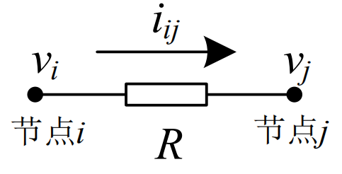
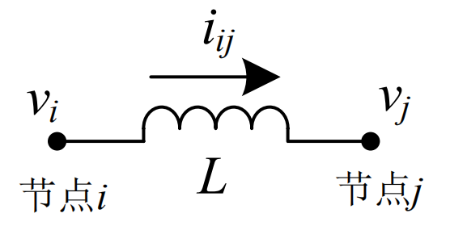
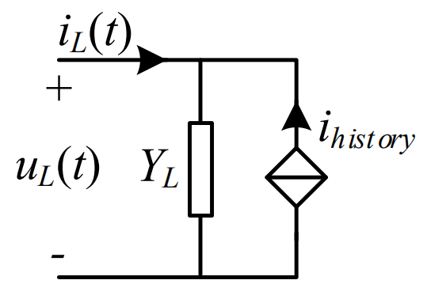
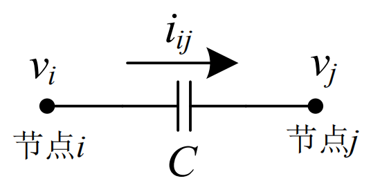
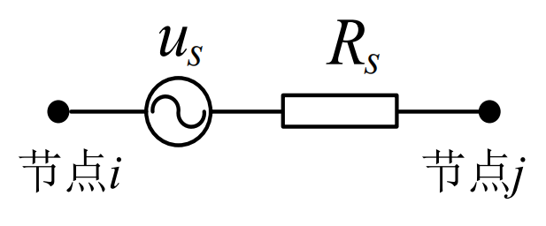
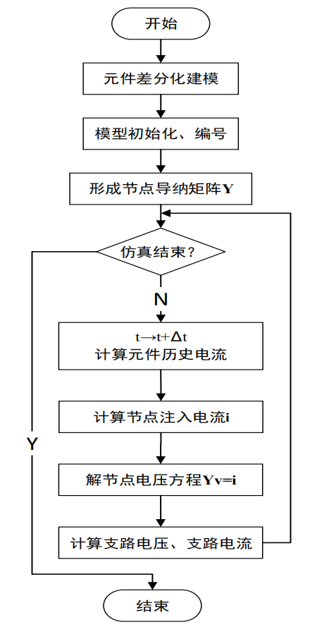
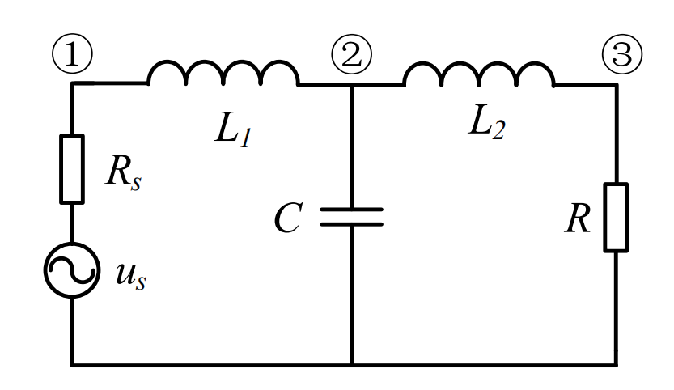
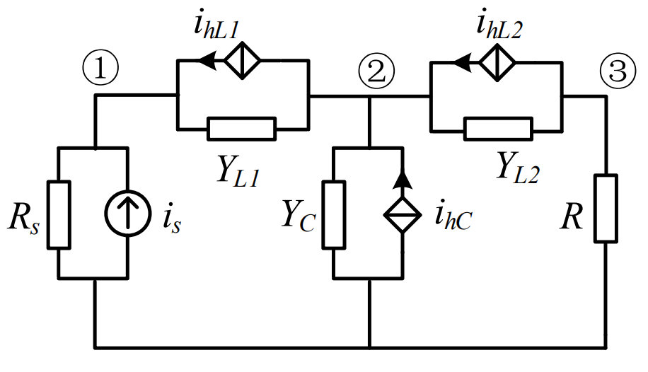

---
presentation:
  enableSpeakerNotes: true
---

```javascript{cmd=true}
// 使用默认格式显示幻灯片页码
Reveal.configure({ slideNumber: true });

// 可供选择的幻灯片页码格式：
//  "h.v":  当前横向幻灯片页码 . 当前纵向幻灯片页码 (默认)
//  "h/v":  当前横向幻灯片页码 / 当前纵向幻灯片页码
//    "c":  当前幻灯片页码（包括横向幻灯片和纵向幻灯片）
//  "c/t":  当前幻灯片页码 / 幻灯片总数
Reveal.configure({ slideNumber: 'c/t' });
```


<!-- slide  data-background-color="#ffebcf"-->
## 基于数字仿真的电力系统应用综合实验

## （二）EMTP基础知识

<br>

**汪可友**
**上海交通大学**

2020年2月


-----------------------------------


<!-- slide  data-background-color="#ffebcf"-->
## 主要内容

- 节点分析vs状态空间
- EMTP基本元件
- EMTP网络求解
- 算例


<!-- slide  data-background-color="#ffebcf"-->
## 节点分析vs状态空间

电力系统的电磁暂态仿真算法主要可以分为两个大类：状态变量法和节点分析法。


<!-- slide  data-background-color="#ffebcf" .element: style="text-align: left;"-->
## 状态变量法
建立描述电力系统电磁暂态特性的代数-微分方程组，利用数值积分方法直接对其进行求解。
- 优点：通用方法，处理非线性模型，调整仿真步长
- 缺点：
  - 单个仿真步内有迭代过程，求解时间较长；
  - 编程复杂

<!-- slide  data-background-color="#ffebcf" .element: style="text-align: left;"-->
## 节点分析法

1960年代，由邦尼韦尔电管局（BPA）的 H. W. Dommel 博士开发，最早用于输电线的电磁暂态仿真。最早采用这一方法的电磁暂态仿真程序以**EMTP**（Electro-Magnetic Transient Programs）著称。不同于基于微分方程模型的状态变量法，该法基于差分电路模型，每个元件先经过数值积分代换后形成差分电路模型，然后建立网络的节点电压方程进行求解，故而称为**节点分析法**。此外，该方法还被称为 **Dommel 方法**、**EMTP 法**等。其优缺点正好和状态变量法相反。

<!-- slide  data-background-color="#ffebcf" .element: style="text-align: left;"-->
## 节点分析法
EMTP优点包括：
- 1、单个仿真步内无迭代过程，求解时间较短；
- 2、形成网络方程简单，易于编程实现；
- 3、易于求解分布参数的输电线模型。

EMTP缺点包括：
- 1、不易于处理非线性模型；
- 2、可能出现数值振荡问题；
- 3、不易于调整仿真步长。


<!-- slide  data-background-color="#ffebcf" .element: style="text-align: left;"-->
## 节点分析法的算法流程

### 1. 元件的差分化
节点分析法中，对电路网络进行求解之前，需要对动态电路元件进行差分化处理。

### 2. 网络方程的建立与求解
利用数值积分法将所有动态元件进行差分化，并将所有元件都用统一的 Norton 等效电路形式表示。下一步就是将电路网络进行编号，由此即可列写网络的节点电压方程， 并进行求解。

<!-- slide  data-background-color="#ffebcf" .element: style="text-align: left;"-->
## 元件的差分化：1）电阻元件
如图所示，节点i 和节点j间的电阻，其特性方程可以表示为：

$$i_{ij}(t)=\frac{1}{R}\left(v_i(t)-v_j(t) \right)$$
<center></center>

电阻的特性方程中不含微分项，因而不需要进行差分化处理。


<!-- slide  data-background-color="#ffebcf" .element: style="text-align: left;"-->
## 元件的差分化：2）电感元件
如图所示，节点i 和节点 j 之间的电感，其特性方程可以表示为：

$$u_L(t)=v_i(t)-v_j(t)=L\frac{di_L(t)}{dt}$$
<center></center>

<!-- slide  data-background-color="#ffebcf" .element: style="text-align: left;"-->
## 元件的差分化：2）电感元件

以梯形法为例，用进行数值积分求解，经整理后可以将电感支路表示为等效导纳与历史电流源的并联的形式：
$$i_L(t)=i_L(t-\Delta t)+\frac{\Delta t}{2 L} \left[u_L(t)+u_L(t-\Delta t)\right] $$
整理
$$
  \begin{matrix}
   i_L(t) & = & \frac{\Delta t}{2 L} u_L(t)+i_L(t-\Delta t)+\frac{\Delta t}{2L}u_L(t-\Delta t) \\
    & = & Y_L u_L(t)-i_{history}(t-\Delta t)
  \end{matrix} 
$$

<!-- slide  data-background-color="#ffebcf" .element: style="text-align: left;"-->
## 元件的差分化：2）电感元件

其中， $Y_L$为电感的等效导纳， $i_{history}(t-\Delta t)$为历史电流源：
$$
\begin{cases}
Y_L= \frac{\Delta t}{2L} \\
i_{history}(t-\Delta t)= -i_L(t-\Delta t)- \frac{\Delta t}{2L} u_L(t-\Delta t)
\end{cases} 
$$


利用上述模型的整理形式，可以得到如图的 Norton 等效电路，即电感的差分电路模型。
<center></center>


<!-- slide  data-background-color="#ffebcf" .element: style="text-align: left;"-->
## 元件的差分化：3）电容元件
如图所示，电容元件的特性方程可以表示为：
$$i_C(t)=i_{ij}(t)=C\frac{d(v_i-v_j)}{dt}=\frac{du_C}{dt}$$
<center></center>

与电感类似，可以用梯形法积对电容的特性方程进行数值积分求解得：
$$ u_C(t)= u_C(t-\Delta t)+\frac{\Delta t}{2C} \left[i_C(t) + i_C(t-\Delta t) \right]$$


<!-- slide  data-background-color="#ffebcf" .element: style="text-align: left;"-->
## 元件的差分化：3）电容元件

为了将所有元件整理成统一的 Norton 形式，该方程经过整理得：
$$
  \begin{matrix}
   i_C(t) & = & \frac{2C}{\Delta t}u_C(t)-\frac{2C}{\Delta t} u_C(t-\Delta t)- i_C(t-\Delta t)\\
    & = & Y_C u_C(t)-i_{history}(t-\Delta t)
  \end{matrix} 
$$
其中， $Y_C$ 为电容等效导纳， $i_{history}(t-\Delta t)$为历史电流源：
$$
\begin{cases}
Y_C=\frac{2C}{\Delta t} \\
i_{history}(t-\Delta t)=\frac{2C}{\Delta t} u_C(t-\Delta t)+ i_C(t-\Delta t)
\end{cases}
$$

<!-- slide  data-background-color="#ffebcf" .element: style="text-align: left;"-->
## 元件的差分化：3）电容元件

由此，可以得到形如图的 Norton 等效电路。

<center></center>


<!-- slide  data-background-color="#ffebcf" .element: style="text-align: left;"-->
## 元件的差分化：4）交流电压源
交流电压源为电力系统中常见的电源元件。交流电压源的建模方式为一个理想电压源与一个小电阻串联，如图所示。交流电压源同样需要转化成统一的 Norton 等效电路形式。由于电压源特性方程不含微分项，因此也不需要进行差分化。

<center></center>


<!-- slide  data-background-color="#ffebcf" .element: style="text-align: left;"-->
## 元件的差分化：4）交流电压源
设交流电压源的瞬时值为 

$$u_s(t)=A sin(\omega t + \phi)$$

其中 $A$ 为电压源幅值，$\omega$ 、$\phi$ 为别为角速度与初始相位，转化成 Norton 等效电路可以表示为：
$$
\begin{cases}
Y_s=\frac{1}{R_s} \\
i_{s}(t)=\frac{A}{R_s} sin(\omega t + \phi)
\end{cases}
$$
注意：此处假设交流电压源的内阻必须设置（如果处理忽略内阻的理想电压源则需要改进的节点分析法）

<!-- slide  data-background-color="#ffebcf" .element: style="text-align: left;"-->
## 网络方程的建立与求解：

节点分析法的算法流程如图所示。
<center></center>

<!-- slide  data-background-color="#ffebcf" .element: style="text-align: left;"-->
## 算例：简单 LCL 滤波电路
为了更直观地说明网络方程的建立和求解过程，下面以如图所示的简单 LCL 滤波电路为例，进行说明。           
<center></center>


<!-- slide  data-background-color="#ffebcf" .element: style="text-align: left;"-->
## 算例：等值电路网络
根据元件差分化方法，将上图中的动态网络，表示成如图所示的 Norton 等效电路组成的网络。      
<center></center>


```{hide}
<!-- slide  data-background-color="#ffebcf" .element: style="text-align: left;"-->
## 算例：
然后，以节点 2 为例，说明节点电压方程的形成。与节点 2 相连的有两个电感支路和一个电容支路，根据元件差分电路模型，可以列写各个支路的电流表达式如下：
$$
\begin{cases}
i_{21}(t)=\frac{\Delta t}{2 L_1}\left( v_2(t)-v_1(t)\right)+i_{hL1} \\
i_{20}(t)=\frac{2C}{\Delta t}\left( v_2(t)-0\right)-i_{hC} \\
i_{23}(t)=\frac{\Delta t}{2 L_2}\left( v_2(t)-v_3(t)\right)-i_{hL2} \\
\end{cases}
$$

<!-- slide  data-background-color="#ffebcf" .element: style="text-align: left;"-->
## 算例：
根据基尔霍夫电流定律，有节点 2 处注入电流之和为 0，据此就可以将上式整理成节点电压方程的形式，
$$ -\frac{\Delta t}{2 L_1} v_1(t）+\left[ \frac{\Delta t}{2L_1}+\frac{2C}{\Delta t}+\frac{\Delta t}{2 L_2}\right]v_2(t)-\frac{\Delta t}{2 L_2}v_3(t)=-i_{hL1}+i_{hC}+i_{hL2}$$
```

<!-- slide  data-background-color="#ffebcf" .element: style="text-align: left;"-->
## 算例：节点电压方程

整理成如下矩阵形式的节点电压方程：
$$ \bm{Yv} (t)=\bm{i}(t)$$

具体展开后有网络方程如下：
$$
\begin{matrix}
\left[ \begin{matrix}
\frac{1}{R_s}+\frac{\Delta t}{2L_1}& -\frac{\Delta t}{2L_1} & 0\\
-\frac{\Delta t}{2L_1} & \frac{\Delta t}{2L_1}+\frac{2C}{\Delta t}+\frac{\Delta t}{2L_2} & -\frac{\Delta t}{2L_2}\\
0 & -\frac{\Delta t}{2L_2} & \frac{\Delta t}{2L_2}+\frac{1}{R}
\end{matrix} \right]
\left[ \begin{matrix}
v_1 \\ v_2\\ v_3
\end{matrix} \right] \\
= \left[ \begin{matrix}
\frac{u_s}{R_s}+i_{hL1}\\
-i_{hL1}+i_{hC}+i_{hL2}\\
-i_{hL2}
\end{matrix} \right]
\end{matrix}
$$