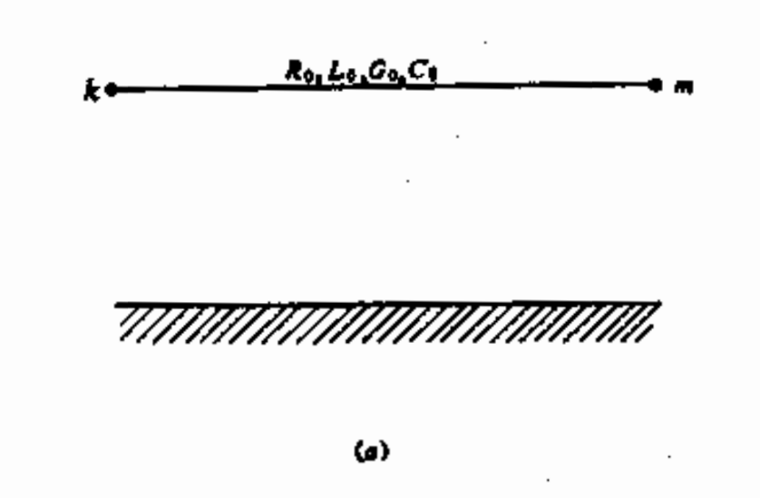
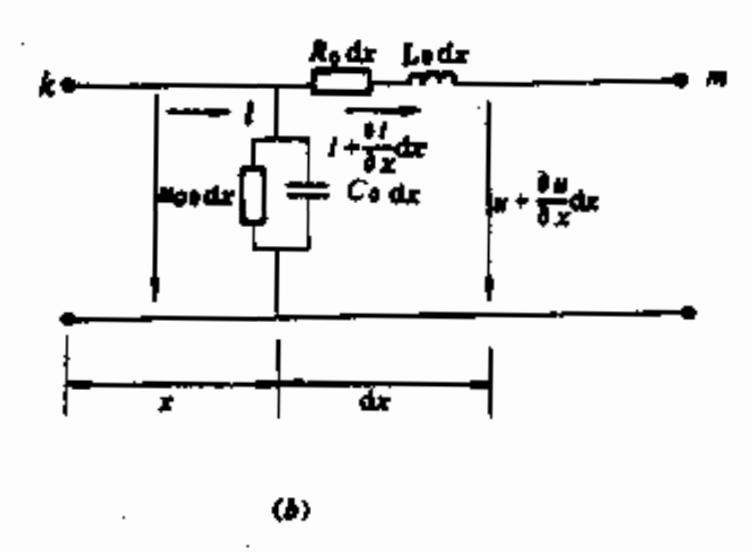
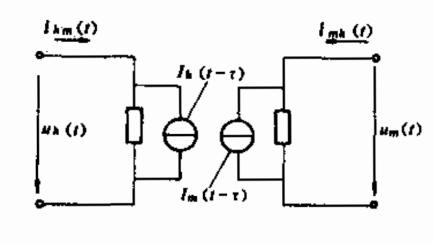
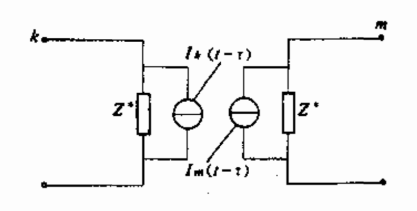
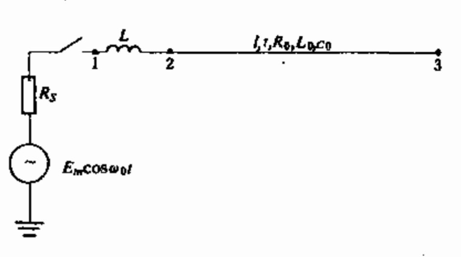

## 输电线路模型

输电线路模型通常有集中参数模型$\pi$行等效模型、分布参数模型(贝瑞隆模型和频率依赖模型)。通常短距离输电线路（数十km），其传播时间小于仿真步长。当长距离输电线路(数百公里)的电磁暂态仿真或者仿真步长极小时，可以采用行波理论建立更为准确的模型，同时也获得自然解耦的并行求解优势。

### 贝瑞隆Bergeron模型：单导线系统
贝瑞隆Bergeron模型是一种基于行波理论、简单定常频率模型。Dommel方法基于该模型建立了传输线双端诺顿等效模型，并嵌入了EMTP算法。

<center></center>

```{hide}
<center></center>
```

首先以单导线-地系统为例介绍。以线路分布参数$R_0,L_0$表示单位长度线路的串联电阻、电感，$G_0,C_0$表示单位长度线路的对地电导、电容。$x$为从线路一段$k$到微分单元$dx$的距离，$x$的正方向与电流$i$的正方向一致。$u$和$i$是$x$和时间$t$的函数。可列出微分方程如下，即线路的波动方程：

$$
\begin{matrix}
-\frac{\partial u}{\partial x}&=R_0 i + L_0 \frac{\partial i}{\partial t}\\\\
-\frac{\partial i}{\partial x}&=G_0 i + C_0 \frac{\partial u}{\partial t}
\end{matrix}
$$

### 拉式变换及通解象函数

拉式变换，令$\mathcal{L}[i(x,t)]=I(x,s)$,$\mathcal{L}[u(x,t)]=U(x,s)$,$Z_0(s)=R_0+sL_0$, $Y_0=G_0+sC_0$,可得
$$
\begin{matrix}
-\frac{dU(x,s)}{dx}&=Z_0(s)I(x,s)\\ \\
-\frac{dI(x,s)}{dx}&=Y_0(s)U(x,s)
\end{matrix}
$$

对上式再做一次微分，得
$$
\begin{matrix}
\frac{d^2U(x,s)}{dx^2}&=Z_0(s)Y_0(s)U(x,s)\\ \\
\frac{d^2I(x,s)}{dx^2}&=Y_0(s)Z_0(s)I(x,s)
\end{matrix}
$$

通解象函数形式为
$$
\begin{matrix}
U(x,s)&=F_1(s)e^{-\gamma(s)x}+F_2(s)e^{\gamma(s)x}\\ \\
I(x,s)&=\frac{1}{Z(s)}\left[F_1(s)e^{-\gamma(s)x}-F_2(s)e^{\gamma(s)x}\right]
\end{matrix}
$$
其中 $\gamma(s)=\sqrt{Z_0(s)Y_0(s)}$, $Z(s)=\sqrt{Z_0(s)/Y_0(s)}$被称为运算形式的传播常数和特征阻抗。$F_1(s), F_2(s)$为待定象函数，可用边界条件确定。

下面改写$\gamma(s)$和$Z(s)$为如下形式：
$$
\begin{matrix}
\gamma(s)&=\frac{1}{v}\sqrt{(s+\alpha)^2-\beta^2}\\ \\
Z(s)&=Z_c\sqrt{\frac{s+\alpha+\beta}{s+\alpha-\beta}}
\end{matrix}
$$
其中
$$
\begin{matrix}
v&=\frac{1}{\sqrt{L_0 C_0}}\\ \\
\alpha&=\frac{1}{2} \left(\frac{R_0}{L_0}+\frac{G_0}{C_0}\right)\\ \\
\beta&=\frac{1}{2} \left(\frac{R_0}{L_0}-\frac{G_0}{C_0}\right)\\  \\
Z_c&=\sqrt{\frac{L_0}{C_0}}
\end{matrix}
$$
式中，$v$、$\alpha$、$\beta$、$Z_c$分别被称为输电线路的\textbf{传播速度、衰减常数、畸变常数}和无损线的特征阻抗。

### 无损线模型
无损线路意味着$R_0=0,G_0=0$，因此有$\alpha=\beta=0,\gamma(s)=\frac{s}{v},Z(s)=Z_c$.带入通解形式，得出
$$
\begin{matrix}
U(x,s)&=F_1(s)e^{-s\frac{x}{v}}+F_2(s)e^{s\frac{x}{v}}\\ \\
I(x,s)&=\frac{1}{Z_c}\left[F_1(s)e^{-s\frac{x}{v}}-F_2(s)e^{s\frac{x}{v}}\right]
\end{matrix}
$$
对上式进行拉式反变换，可得通解为
$$
\begin{matrix}
u(x,t)&=f_1(t-\frac{x}{v})+f_2(t+\frac{x}{v})\\ \\
i(x,t)&=\frac{1}{Z_c}\left[f_1(t-\frac{x}{v})-f_2(t+\frac{x}{v})\right]
\end{matrix}
$$
式中$f_1$、$f_2$具体形式由边界条件确定。$f_1(t-\frac{x}{v})$代表沿$x$正方向传播的前行波，$f_2(t+\frac{x}{v})$代表沿$x$负方向传播的后行波。对于无损线路，前行波和反行波均无衰减和畸变($\alpha$,$\beta$均为零)。

### 无损线的贝瑞隆等值电路
整理上式，可得
$$
\begin{matrix}
u(x,t)+Z_ci(x,t)&=2f_1(t-\frac{x}{v})\\ \\
u(x,t)-Z_ci(x,t)&=2f_2(t-\frac{x}{v})
\end{matrix}
$$

如果$t-\frac{x}{v}=constant$,则$f_1(t-\frac{x}{v})=constant$，即$u(x,t)+Z_ci(x,t)=constant$。其含义如下：如果一个观察者沿$x$正方向以速度$v$运动，那么由于他观察到任一时刻的$t-\frac{x}{v}$均为常数，因此$u(x,t)+Z_ci(x,t)$也是常数。那么该观察者在$t-\tau$时刻从$k$端出发，经时间$\tau=\frac{l}{v}$($l$为线路长度)后于$t$时刻到达$m$端，则观察者在$t-\tau$时刻和$t$时刻所观察到的$f_1(x-\frac{x}{v})$是相同的。即

$$
u_k(t-\tau)+Z_c i_{km}(t-\tau)=u_m(t)+Z_c[-i_{mk}(t)]
$$
同理，从反方向看过来，另一端可得出类似的结论。假设$t+\frac{x}{v}=$常数。观察者沿$x$负方向在$t-\tau$时刻从$m$端出发，于$t$时刻到达$k$端，则从起点到终点所观察到的$f_2(t+\frac{x}{v})$保持不变。即
$$
u_m(t-\tau)-Z_c[-i_{mk}(t-\tau)]=u_k(t)-Z_ci_{km}(t)
$$

整理上面2个式子，可得出双端诺顿等效电路，即无损线的贝瑞隆等值电路如下：
$$
\begin{matrix}
i_{km}(t)&=\frac{1}{Z_c} u_k(t)+I_k(t-\tau)\\ \\
i_{mk}(t)&=\frac{1}{Z_c} u_m(t)+I_m(t-\tau)
\end{matrix}
$$
其中历史电流源项为
$$
\begin{matrix}
I_k(t-\tau)&=-\frac{1}{Z_c}u_m(t-\tau)-i_{mk}(t-\tau)\\ \\
I_m(t-\tau)&=-\frac{1}{Z_c}u_k(t-\tau)-i_{km}(t-\tau)
\end{matrix}
$$
如图所示：

<center></center>

### 有损线模型
实际线路需要考虑损耗，通常$G_0$很小可以忽略，但$R_0$通常不能忽略为零。有损线路等效模型如下（推导过程从略）：

$$
\begin{matrix}
I_{k}(t-\tau)=&\frac{1+h}{2}\left[ -\frac{1}{Z^\star}u_m(t-\tau)-h i_{mk}(t-\tau)\right]\\ 
&+\frac{1-h}{2}\left[ -\frac{1}{Z^\star}u_k(t-\tau)-h i_{km}(t-\tau)\right]\\ \\
I_{m}(t-\tau)=&\frac{1+h}{2}\left[-\frac{1}{Z^\star}u_k(t-\tau)-h i_{km}(t-\tau) \right]\\
&+\frac{1-h}{2}\left[-\frac{1}{Z^\star}u_m(t-\tau)-h i_{mk}(t-\tau)   \right] 
\end{matrix}
$$

其中，
$$ h=\frac{Z_c-\frac{R}{4}}{Z_c+\frac{R}{4}}, Z^\star=Z_c+\frac{R}{4}$$
<center></center>

### 算例：交流电源合闸空载线路的暂态过程
本例题应用贝瑞隆模型来分析输电线路合闸于交流电源的暂态过程算例。如图所示系统的数据如下：
交流电源$R_s=10\Omega$,$E_m=1pu$,$\omega=314.15927rad/s$,集中参数线路参数$L=16mh$,分布参数线路参数$R_0=0.2312\Omega/km$,$L_0=2.3779mH/km$,$C_0=0.00898\mu F/km$,线路长度$l=320km$,仿真步长$\Delta t=200ms$,仿真时长$T_{max}=0.04s$。

<center></center>

首先根据EMTP算法中RLC元件、电源、分布参数线路（贝瑞隆模型）建立等值电路模型，如下图：
<center></center>

假设$t=0$时刻空载线路合闸，可根据KCL和KVL列些节点分析方程$G \bm{u}=\bm{i}$,如下：
$$
\left[ \begin{matrix}
\frac{1}{R_s}+\frac{1}{R_L} & -\frac{1}{R_L} & 0 \\
-\frac{1}{R_L} & \frac{1}{R_L}+\frac{1}{Z^\star} & 0 \\
 0 & 0 & \frac{1}{Z^\star} 
\end{matrix}\right]
\left[ \begin{matrix}
u_1(t) \\ u_2(t) \\ u_3(t)
\end{matrix}\right]
=\left[ \begin{matrix}
i_s(t)-I_L(t-\Delta t) \\  I_L(t-\Delta t)- I_2(t-\tau) \\ -I_3(t-\tau)
\end{matrix}\right]
$$

仿真计算步骤：
1. 输入原始数据： $R_s$, $E_m$, $L$, $L_0$, $R_0$, $C_0$, $l$, $\Delta t$, $T_{max}$。 

2. 计算节点分析方程中的系统电导矩阵$G$。
其中需要计算：
- 集中参数线路：$R_L=\frac{2L}{\Delta t}$
- 分布参数线路：
$$
Z^\star=Z_c+\frac{R}{4}, h=\frac{Z_c-\frac{R}{4}}{Z_c+\frac{R}{4}}, Z_c=\sqrt{\frac{L_0}{C_0}}, \tau=\frac{l}{v}=l*\frac{1}{\sqrt{L_0 C_0}}
$$

3. 初始化$t=0$时刻状态。
因为线路空载，线路末端$i_{32}(t=0)=0$。

4. 时域仿真循环开始，设定$t=t+\Delta t$。

5. 更新节点注入电流向量$\bm{i}$，其中包括计算$i_s(t),I_L(t-\Delta t), I_2(t-\tau), I_3(t-\tau)$。
具体过程如下：
- 交流电源的诺顿等效为电流源：
$$ i_s(t)=\frac{E_m}{R_s}cos(\omega_0 t)$$
- 集中参数线路$L$的历史电流源项:
$$ I_L(t)=\frac{1}{R_L}\left[ u_1(t-\Delta t) -u_2(t-\Delta t)\right]+i_L(t-\Delta t)$$

- 分布参数线路的等效模型中历史电流源项：
$$ 
\begin{matrix}
I_2(t-\tau)=&\frac{1+h}{2}\left[-\frac{1}{Z^\star}u_3(t-\tau)-h i_{32}(t-\tau) \right] \\
& +\frac{1-h}{2} \left[ -\frac{1}{Z^\star} u_2(t-\tau)- h i_{23} (t-\tau) \right]\\ \\
I_3(t-\tau)=& \frac{1+h}{2} \left[ -\frac{1}{Z^\star}u_2(t-\tau) - h i_{23}(t-\tau) \right] \\ 
& +\frac{1-h}{2} \left[ -\frac{1}{Z^\star} u_3(t-\tau) - h i_{32}(t-\tau)  \right]
\end{matrix}
$$

>注意事项： 上面计算过程中$I_L(t-\Delta t)$ 由 $t-\Delta t$时刻的变量确定，而$I_2(t-\tau), I_3(t-\tau)$由$t-\tau$时刻的变量确定。需要保存相关变量$(u_2, u_3, i_{23}, i_{32})$等的历史记录。因此可知，仿真步长$\Delta t$的大小需要考虑线路时间常数$\tau$的影响，即$\Delta t< \tau$。 通常$\tau$不是$\Delta t$的整数倍，因此$t-\tau$时刻的变量需要插值。以电流为例，设$n\Delta t< \tau < (n+1)\Delta t$, **线性插值公式**为：
$$
i(t-\tau)=i(t-n\Delta t)-(\tau -n \Delta t)\frac{i(t-n \Delta t)-i\left[ t-(n+1)\Delta t\right]}{\Delta t}
$$
对于电压量亦同样插值处理不赘述。

6. 求解节点电压方程（为线性方程组），求出$u_1(t),u_2(t), u_3(t)$。
其中需要用到线性方程组求解技术，诸如高斯消去（$LU$分解法），迭代法（共轭梯度法，子空间法等）。同学们此处可使用matlab自带函数求解线性方程组$AX=b$,示例如下：
```matlab
A=[1 2 3; 4 5 6; 7 8 9]; b=[1 1 1]';
x=A\b
```
7. 更新支路电流。即求$i_{23}(t),i_{32}(t),i_L(t)$。
- 贝瑞隆模型:
$$
\begin{cases}
i_{23}(t)=\frac{1}{Z^\star} u_2(t)+I_2(t-\tau)\\
i_{32}(t)=\frac{1}{Z^\star} u_3(t)+ I_3(t-\tau)
\end{cases}
$$

- 集中参数$L$:
- - 法1： $i_L(t)=\frac{1}{R_L}\left[u_1(t)-u_2(t) \right]+I_L(t-\Delta t)$
- - 法2： $i_L(t)=i_{23}(t)$

8. 存储或输出相关计算结果。

9. 更新到下一时步，$t+\Delta t \rightarrow t$,重复步骤$5-8$,直到$t>T_{max}$仿真结束。