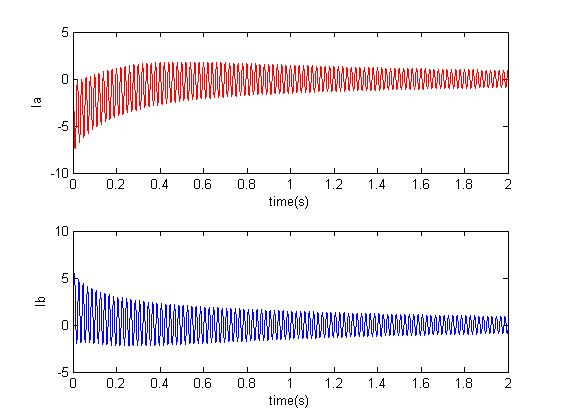
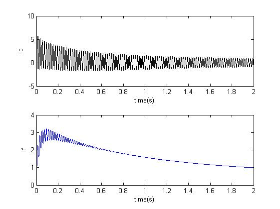

## 同步发电机突然短路暂态过程分析

同步发电机是电力系统中最重要和最复杂的元件，对同步发电机动态特性的研究历来是电力系统分析的重要环节之一。本章的目的是通过介绍同步发电机的基本方程、暂态过程分析的基本方法和数字仿真的计算机实现，来进行同步发电机暂态过程的数字仿真模拟。

### 同步发电机基本方程回顾
同步发电机的基本方程-Park变化和等值电路的简单回顾。本章先从Park变化方程入手，来分析同步发电机的机端短路暂态过程，为讨论问题方便和聚焦于短路暂态过程分析，做以下假设：
- 发电机转速保持恒定；
- 励磁绕组电压$u_F$保持恒定。

考虑发电机七个绕组：定子的$d$、$q$绕组，转子$d$轴的$F$绕组（励磁绕组）和$D$绕组（阻尼绕组）、转子$q$轴的$H$、$Q$绕组（阻尼绕组）。同步发电机的基本方程(暂不考虑零序分量)为

$$
\begin{matrix}
\bm{u}&=&p\bm{\psi}+\bm{\omega \psi}+\bm{r i}  
\end{matrix}	
\tag{1}
$$
$$
\begin{matrix}
\bm{\psi}&=&\bm{x i}  
\end{matrix}	
\tag{2}
$$

式（$1$）是六个电压方程(微分方程），其中$p$是微分符号。 式（$2$）是六个磁链方程(代数方程)。
其中:

电压矢量$\bm{u}$：
$$
\bm{u}= \left[ \begin{matrix}
u_d & u_q & u_F & 0 & 0 & 0
\end{matrix}\right]^T 
$$

磁链矢量$\bm{\psi}$：
$$
\bm{\psi}= \left[ \begin{matrix}
\psi_d & \psi_q & \psi_F & \psi_D & \psi_H & \psi_Q
\end{matrix}\right]^T 
$$

电流矢量$\bm{i}$：
$$
\bm{i}= \left[ \begin{matrix}
i_d & i_q & i_F & i_D & i_H & i_Q
\end{matrix}\right]^T 
$$

电阻矩阵$\bm{r}$、电抗矩阵$\bm{x}$ 和 矩阵$\bm{\omega}$：
$$
\bm{r}=diag\left[ \begin{matrix}
-r & -r & r_F & r_D & r_H & r_Q 
\end{matrix} \right]
$$

$$
\bm{x} =\left[ \begin{matrix}
-x_d & 0  & x_{ad} & x_{ad} & 0 & 0\\ 
0 & -x_q & 0 & 0 & x_{aq} & x_{aq} \\
-x_{ad} & 0 & x_F & x_{FD} & 0 & 0 \\
-x_{ad} & 0 & x_{FD} & x_D & 0 & 0 \\
0 & -x_{aq} & 0 & 0 & x_H & x_{aq} \\
0 & -x_{aq} & 0 & 0 & x_{aq} & x_Q
\end{matrix} \right]
$$

$$
\bm{\omega} = \left [ \begin{matrix} 
 0 & -\omega & 0 & 0 & 0 & 0\\
 \omega & 0 & 0 & 0 & 0 & 0\\
 \hline\\
 & & \bm{O} & 
\end{matrix} \right]
$$

为了计算过程尽量简洁，可将磁链方程代入电压方程，消去磁链变量，可得电压方程：
$$
\bm{u}= \bm{x}p \bm{i}+(\bm{\omega x+r})\bm{i}= \bm{x}p \bm{i}+\bm{yi}
\tag{3}
$$
其中 
$$
\bm{y}=\bm{\omega x+r}=\left[ \begin{matrix}
-r & \omega x_q & 0 & 0 & -\omega x_{aq} & -\omega x_{aq}\\
-\omega x_d & -r & \omega x_{ad} & \omega x_{ad} & 0 & 0 \\
0 & 0 & r_F & 0 & 0 & 0 \\
0 & 0 & 0 & r_D & 0 & 0 \\
0 & 0 & 0 & 0 & r_H & 0 \\
0 & 0 & 0 & 0 & 0 & r_Q
\end{matrix} \right]
$$

### 同步发电机差分化方程
下面对式($3$)进行差分化。按如下三点规则：
- 带有微分算子($p$)的向量 $\bm{f}$ 以 $\frac{1}{\Delta t}\left[ \bm{f}(t)-\bm{f}(t-\Delta t)\right]$ 代入；
- 不带微分算子($p$)的向量$\bm{f}$ 以$\frac{1}{2}\left[ \bm{f}(t)+\bm{f}(t-\Delta t)\right]$代入；
- 常系数矩阵或常数向量保持不变。

差分化后方程变为：

$$
\frac{1}{2}\left[\bm{u}(t)+\bm{u}(t-\Delta t)\right] = \bm{x} \frac{\bm{i}(t)-\bm{i}(t-\Delta t)}{\Delta t}+\frac{\bm{y}}{2} \left[\bm{i}(t)+\bm{i}(t-\Delta t)\right]
$$

整理后，有
$$
\bm{C} \bm{i}(t) = \bm{D} \bm{i}(t-\Delta t) + \bm{E}
\tag{4}
$$
其中
$$
\begin{cases}
\bm{C}= \bm{x}+\frac{\Delta t}{2} \bm{y} \\
\bm{D}= \bm{x}- \frac{\Delta t}{2} \bm{y} \\
\bm{E} = \frac{\Delta t}{2} \left[\bm{u}(t)+\bm{u}(t-\Delta t) \right]
\end{cases}
$$

### 同步发电机突然三相短路

同步发电机三相短路过程的数字仿真，除了根据式($4$)进行数字仿真,还需要其他若干必要步骤：
1. 初始化：本节讨论同步发电机空载短路，因此初始条件下，除了下列值之外，其余各电压、电流的初值均为$0$:

	$$
	\begin{cases}
	u_{q|0|} = U\\
	i_{F|0|} = \frac{u_{q|0|}}{x_{ad}}\\
	u_{F|0|} = r_F i_{F|0|}	
	\end{cases}
    \tag{5}
	$$
	其中 $U$为机端电压初始值。

2. 每一步更新电流向量后，坐标变换得出$abc$坐标下的电流值。
	$$
	\left[ \begin{matrix}
	f_a \\ f_b \\f_c
	\end{matrix} \right] = \left[ \begin{matrix}
	cos \theta & - sin \theta \\
	cos (\theta -\frac{2 \pi}{3}) & - sin(\theta- \frac{2 \pi}{3}) \\
	cos (\theta +\frac{2 \pi}{3})  & - sin(\theta+ \frac{2 \pi}{3}) 
	\end{matrix} \right]   \left[ \begin{matrix}
	f_d \\ f_q
	\end{matrix} \right]
    \tag{6}
    $$
	其中假设发电机转速保持恒定，计算发电机转子$d$轴领先于定子$a$轴的角度$\theta=\theta_0+\omega \Delta t$。

同步发电机参数表格

| $x_d$ | $x_{ad}$ | $x_F$ | $x_D$ | $x_{FD}$ | $r_F$  | $r_D$|
| :---- | :---- | :---- | :---- | :---- | :---- | :---- |
| $d$轴电抗 | $ad$互感 | $F$绕组电抗 | $D$绕组电抗 | $FD$互感 | $F$绕组电阻 | $D$绕组电阻|
|$x_q$ | $x_{aq}$ | $x_H$ | $x_Q$| $ r_H$ | $r_Q$  | $r$|
|$q$轴电抗 | $aq$互感 | $H$绕组电抗 | $Q$绕组电抗 | $H$绕组电阻 |$Q$绕组电阻 | 定子绕组电阻|

同步发电机三相短路过程的数字仿真的具体步骤如下：

1. 读入发电机参数$x_d,x_{ad},x_{aq},x_{FD},x_F,x_D,x_H,x_Q,r,r_F,r_D,r_H,r_Q$,给定短路前机端电压的初值$U$,仿真步长$\Delta t$, 最大仿真时间 $T_{max}$， 转子$d$轴相对于定子$a$轴的初始相位角$\theta_0$。
	
2. 在$t=0$时刻，根据式($5$)初始化电压向量$\bm{u}(t)$和电流向量$\bm{i}(t)$。历史电压向量$\bm{u}(t-\Delta t)$和历史电压向量$\bm{i}(t-\Delta t)$均为零向量。
	
3. 设定 $t=t+\Delta t$,
	
4. 通过求解方程 ($4$}),来更新电流向量 $\bm{i}(t)$；
	
5. 通过Park反变换($6$)，计算$abc$坐标下的电流值；
	
6. $t+\Delta t \rightarrow t$, 重复进行 步骤3至5， 直至 $t \geq T_{max}$。

### 算例:同步发电机空载短路的暂态过程
下表给出了一台300MW汽轮发电机的等值电路参数。参数均已折算为标幺值(p.u.)。 假定初始条件为发电机空载时机端电压$U=1.0pu$,$\theta_0=0$。 取仿真步长$\Delta t=0.0005s$，仿真时间$T_{max}=1.0s$。计算三相突然短路后的三相电流和励磁电流。
		
|$x_d$ | $x_{ad}$ | $x_F$ | $x_D$| $x_{FD}$ | $r_F$ | $r_D$|
| :---- | :---- | :---- | :---- | :---- | :---- | :---- |
|1.75581 | 1.56711 | 1.73883 | 1.63555 | 1.61805 | 0.00113 |0.00929|
|$x_q$ | $x_{aq}$ | $x_H$ | $x_Q$| $ r_H$ | $r_Q$  | $r$|
|1.75581 | 1.56711 | 2.22911 | 1.64064 | 0.01862 | 0.01788 | 0.004|

**解：**
根据前述的同步发电机三相短路过程仿真的具体步骤。

- 首先读取数据。

- 开始计算初始化条件，$t=0$时刻，

- - 电压向量初始值：
$$
\begin{matrix}
\bm{u}_{|0|}&=&\left[ \begin{matrix}
0 & u_{q|0|} & u_{F|0|} & 0 & 0 & 0 
\end{matrix} \right]^T\\
&=&\left[ \begin{matrix}
0 & 1.0000 & 0.0007 & 0 & 0 & 0 
\end{matrix} \right]^T
\end{matrix}
$$

电流向量初始值：
$$
\begin{matrix}
\bm{i}_{|0|}&=&\left[ \begin{matrix}
0 & 0 & i_{F|0|} & 0 & 0 & 0 
\end{matrix} \right]^T\\
&=&\left[ \begin{matrix}
0 & 0 & 0.6381 & 0 & 0 & 0 
\end{matrix}\right]^T
\end{matrix}
$$

式($4$)中的固定参数矩阵$C$如下:
$$
\bm{C}=\bm{x}+\frac{\Delta t}{2} \bm{y}=\left[ \begin{matrix}
  -1.7561 &   0.1379  &  1.5671 &   1.5671  & -0.1231 &  -0.1231 \\
-0.1379 &  -1.7561 &   0.1231 &   0.1231&    1.5671 &   1.5671 \\
-1.5671  &       0  &  1.7389  &  1.6181    &     0    &     0 \\
-1.5671  &       0  &  1.6181  &  1.6363     &    0    &     0 \\
0  & -1.5671 &        0    &     0  &  2.2306  &  1.5671 \\
0  & -1.5671    &     0     &    0  &  1.5671  &  1.6420 \\
\end{matrix} \right]
$$
此外，可以对$\bm{C}$矩阵进行LU分解，并记录因子表用于线性方程组求解($4$)。 

矩阵$\bm{D}$同样可得:
$$
\bm{D}=\bm{x}-\frac{\Delta t}{2} \bm{y}= \left[ \begin{matrix}
   -1.7555 &  -0.1379 &   1.5671 &   1.5671 &   0.1231 &   0.1231 \\
0.1379 &  -1.7555  & -0.1231  & -0.1231   & 1.5671 &   1.5671\\
-1.5671    &     0  &  1.7387   & 1.6181 &        0  &       0\\
-1.5671    &     0   & 1.6181  &  1.6348   &      0   &      0\\
0  & -1.5671    &     0   &      0  &  2.2276  &  1.5671\\
0 &  -1.5671   &      0   &     0 &   1.5671  &  1.6392\\
\end{matrix} \right]
$$

下面处理差分方程($4$)中向量$\bm{E}= \frac{\Delta t}{2} \left[\bm{u}(t)+\bm{u}(t-\Delta t) \right]$。三相短路的边界条件为
$$
\begin{matrix}
u_a=u_b=u_c=0\\
u_d=u_q=u_0=0
\end{matrix}
$$
加上假设条件励磁绕组电压$u_F=u_{F|0|}$保持不变。
可以推出，当$t \neq 0$时， 
$$\bm{u}(t)=\left[ \begin{matrix}
0 & 0 & u_{F|0|} & 0 & 0 & 0 \\
\end{matrix}\right]^T $$

可以求解迭代方程：
$$
\bm{C} \bm{i}(t) = \bm{D} \bm{i}(t-\Delta t) + \bm{E}
$$

发电机机端三相短路计算结果：	(a)定子a相电流； (b)定子b相电流;(c)定子c相电流;(d)励磁电流

